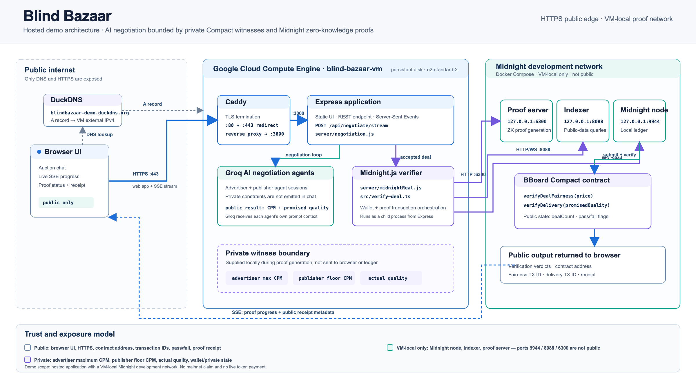

# Blind Bazaar Architecture



Blind Bazaar separates AI negotiation from verifiable settlement. Groq-powered agents can negotiate a public CPM and promised quality, but Midnight determines whether that agreement satisfies the parties' private bounds.

## Hosted topology

```text
Browser
  │ HTTPS
  ▼
DuckDNS → Caddy reverse proxy → Express application on Google Compute Engine
                                  │
                                  ├─ Groq agent negotiation + Server-Sent Events
                                  └─ Midnight.js verifier process
                                           │
                                           ▼
                              VM-local Midnight Docker services
                              node · indexer · proof server
                                           │
                                           ▼
                                BBoard Compact contract
```

The browser reaches the hosted demo through `https://blindbazaar-demo.duckdns.org`. Caddy terminates TLS and proxies requests to the Express app. Only ports 80 and 443 are public; the Express app and all Midnight services are local to the VM.

## Runtime flow

1. The browser starts an auction and receives transcript events through Server-Sent Events.
2. An advertiser agent and one or two publisher agents negotiate a public CPM and promised quality using Groq.
3. When an agent accepts a deal, `server/negotiation.js` starts the real verifier through `server/midnightReal.js`.
4. `blind-bazaar-contract/src/verify-deal.ts` builds a Midnight.js transaction with the local wallet, proof provider, indexer, and generated Compact bindings.
5. The proof server generates zero-knowledge proofs; the local Midnight node accepts the contract calls.
6. The browser receives public verification status, contract address, transaction IDs, and a privacy-safe downloadable receipt.

## Privacy boundary

The following values are Compact witnesses and are not displayed in the UI, proof receipt, or public ledger data:

- advertiser maximum CPM;
- publisher minimum CPM;
- publisher delivery-quality value;
- wallet seed, mnemonic, and private state.

The negotiated offer is public because the agents state it in the transcript. The contract discloses only whether the comparison passed.

## Compact circuits

| Circuit | Private witnesses | Public result |
| --- | --- | --- |
| `verifyDealFairness(price)` | Advertiser max CPM, publisher floor CPM | Proves the agreed price lies within both private bounds; updates `dealCount` and `lastDealValid`. |
| `verifyDelivery(promisedQuality)` | Actual quality | Proves the quality threshold was met; updates `lastDeliveryValid`. |
| `verifyCredential(credentialProof)` | None currently | Non-empty 32-byte placeholder check; not a production identity system. |

## Scope and limits

- The contract is deployed to a **VM-local Midnight development network**, not a public testnet or mainnet.
- The green `$0.05 demo reward` is a UI-only demonstration; no token transfer, escrow, or payment circuit exists yet.
- The current delivery-quality witness is demo-provided. A production system needs an attested quality-data source.
- The hosted demo should be treated as a hackathon deployment. Keep the Groq key, wallet state, and `.env` files private.
